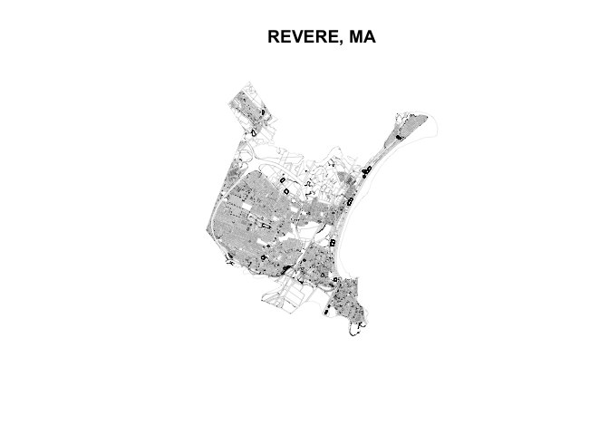

Module02
================
Violet Lingenfelter
January 25, 2019

Data Structure
--------------

This data came to me in the form of a shapefile, meaning there are geometries (land parcels) associated with rows in attribute tables. The main core of the data can be found in the assessor data table. The assessor data table contains information about:

-   building value, land value, other value, and total value
-   use code and zoning information
-   lot size
-   last list date and list price
-   owner name and contact information
-   information about the residence (if applicable)

All information is referenced to the PROP\_ID or LOC\_ID attributes, which each attribute table and the geometries all have.

``` r
# import packages for reading .gdb
require(rgdal)
```

    ## Loading required package: rgdal

    ## Warning: package 'rgdal' was built under R version 3.4.4

    ## Loading required package: sp

    ## Warning: package 'sp' was built under R version 3.4.4

    ## rgdal: version: 1.3-6, (SVN revision 773)
    ##  Geospatial Data Abstraction Library extensions to R successfully loaded
    ##  Loaded GDAL runtime: GDAL 2.1.3, released 2017/20/01
    ##  Path to GDAL shared files: /Library/Frameworks/R.framework/Versions/3.4/Resources/library/rgdal/gdal
    ##  GDAL binary built with GEOS: FALSE 
    ##  Loaded PROJ.4 runtime: Rel. 4.9.3, 15 August 2016, [PJ_VERSION: 493]
    ##  Path to PROJ.4 shared files: /Library/Frameworks/R.framework/Versions/3.4/Resources/library/rgdal/proj
    ##  Linking to sp version: 1.3-1

``` r
require(sf)
```

    ## Loading required package: sf

    ## Warning: package 'sf' was built under R version 3.4.4

    ## Linking to GEOS 3.6.1, GDAL 2.1.3, PROJ 4.9.3

``` r
gdb <- "~/Downloads/M248_parcels_gdb/M248_parcels_sde.gdb"

# List all feature classes in a file geodatabase
subset(ogrDrivers(), grepl("GDB", name))
```

    ##           name    long_name write  copy isVector
    ## 40 OpenFileGDB ESRI FileGDB FALSE FALSE     TRUE

``` r
fc_list <- ogrListLayers(gdb)
# print(fc_list) <<< this would print the names of associated layers, if I needed to see that 

# Read the feature class
fc <- readOGR(dsn=gdb, layer="M248TaxPar") 
```

    ## OGR data source with driver: OpenFileGDB 
    ## Source: "/Users/vlingenfelter5/Downloads/M248_parcels_gdb/M248_parcels_sde.gdb", layer: "M248TaxPar"
    ## with 12838 features
    ## It has 12 fields

``` r
# read the assessor database file 
# (no geometries associated, error is thrown and it turns the .dbf into a dataframe)
# sort the assessor values by total combined parcel value
assessor <- sf::st_read(dsn = gdb, layer = "M248Assess")
```

    ## Reading layer `M248Assess' from data source `/Users/vlingenfelter5/Downloads/M248_parcels_gdb/M248_parcels_sde.gdb' using driver `OpenFileGDB'

    ## Warning: no simple feature geometries present: returning a data.frame or
    ## tbl_df

``` r
# Duplicate Geoms = true becaus multiple Assessor data points have same LOC_ID (to be fixed later)
fc <- merge(fc, assessor, by="LOC_ID", duplicateGeoms=TRUE)

# View the feature class (make sure the geometries match the boundaries of Revere MA)
plot(fc, main="REVERE, MA", lwd=0.075)
```


