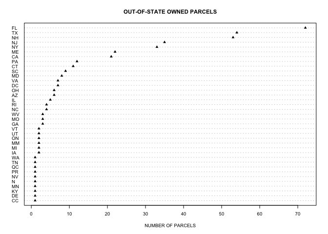

Module02
================
Violet Lingenfelter
January 25, 2019

Data Structure
--------------

This data came to me in the form of a shapefile, meaning there are geometries (land parcels) associated with rows in attribute tables. The main core of the data can be found in the assessor data table. The assessor data table contains information about:

-   building value, land value, other value, and total value
-   use code and zoning information
-   lot size
-   last list date and list price
-   owner name and contact information
-   information about the residence (if applicable)

All information is referenced to the `PROP_ID` or `LOC_ID` attributes, which each attribute table and the geometries all have.

``` r
# import packages for reading .gdb
require(sf)
require(ggplot2)

gdb <- "~/Downloads/M248_parcels_gdb/M248_parcels_sde.gdb"

# read the assessor database file 
# (no geometries associated, error is thrown and it turns the .dbf into a dataframe)
# sort the assessor values by total combined parcel value
assessor <- sf::st_read(dsn = gdb, layer = "M248Assess")
```

    ## Reading layer `M248Assess' from data source `/Users/vlingenfelter5/Downloads/M248_parcels_gdb/M248_parcels_sde.gdb' using driver `OpenFileGDB'

Points of Interest
------------------

### Building Values of Single Family Homes

We can see which type of single family home is most valuable in Revere by looking at building type and building value. From our anlaysis, the most valuable building type is Multi-Garden.

``` r
#  BUILDING VALUE BY HOME STYLE IN SINGLE FAMILY HOMES
# =================================

# find subset of parcels with single family homes
singleFamily <- assessor[assessor$USE_CODE==101,]

# find average building value aggregated by building style for single family homes
buildingByStyle <- aggregate(singleFamily$BLDG_VAL ~ singleFamily$STYLE, FUN = mean)
# correct the column names
names(buildingByStyle) <- c('STYLE', 'AVG_BLDG_VAL')
# sort by building value (high value to low value)
buildingByStyle <- buildingByStyle[order(-buildingByStyle$AVG_BLDG_VAL),]

# create a cleaveland dot chart of average value by building style
# make the markers be little triangles
dotchart(buildingByStyle$AVG_BLDG_VAL, 
         labels=buildingByStyle$STYLE, 
         cex=.9,
         pch=17,
         main="AVERAGE SINGLE FAMILY HOME VALUE BY STYLE",
         xlab="AVERAGE VALUE")
```


### Tax Exempt Parcels

We can use our data to see what parcels are not being taxed. This can tell us intersting information about the landscape in Revere. Are there lots of public lands or government facilities? Are there lots of churches and non profit owned parcels?

By doing a little bit of analysis we can see that around 35% of land in Revere is tax exempt, but this represents only 7% of total parcel values in the city. This tells us that much of the lesser valuable land in Revere is owned by tax exempt entities, or that tax assessors assess the value of tax exempt properties less than their taxed counterparts.

``` r
#  TAX EXEMPT PARCELS
# =================================

# coerce USE_CODE to type numeric so that we can filter using greater than conditions
assessor$USE_CODE <- as.numeric(as.character(assessor$USE_CODE))
# find all parcels wil tax exempt use codes
taxExempt <- assessor[assessor$USE_CODE >= 900,]

# Create if statement to filter by tax exemption type to then find total value based on exemption code
# this was taken from the data source
for (i in (1:NROW(taxExempt))) {
  if (taxExempt[i, "USE_CODE"] < 910) {
  taxExempt[i,"EXEMPT_TYPE"] = "Public Service"
  } else if (taxExempt[i, "USE_CODE"] < 920) {
  taxExempt[i,"EXEMPT_TYPE"] = "MA Reimbursable"
  } else if (taxExempt[i, "USE_CODE"] < 930) {
  taxExempt[i,"EXEMPT_TYPE"] = "MA Nonreimbursable"
  } else if (taxExempt[i, "USE_CODE"] < 940) {
  taxExempt[i,"EXEMPT_TYPE"] = "Municipal or County"
  } else if (taxExempt[i, "USE_CODE"] < 950) {
  taxExempt[i,"EXEMPT_TYPE"] = "Educational Private"
  } else if (taxExempt[i, "USE_CODE"] < 960) {
  taxExempt[i,"EXEMPT_TYPE"] = "Charitable"
  } else if (taxExempt[i, "USE_CODE"] < 970) {
  taxExempt[i,"EXEMPT_TYPE"] = "Religious Groups"
  } else if (taxExempt[i, "USE_CODE"] < 980) {
  taxExempt[i,"EXEMPT_TYPE"] = "Authorities"
  } else if (taxExempt[i, "USE_CODE"] < 990) {
  taxExempt[i,"EXEMPT_TYPE"] = "Held by other town"
  } else {
  taxExempt[i,"EXEMPT_TYPE"] = "Other"
  }
}

# aggregate by exempt type to find total value
taxExemptVal <- aggregate(taxExempt$TOTAL_VAL ~ taxExempt$EXEMPT_TYPE, FUN = sum)
# fix column names
names(taxExemptVal) <- c("EXEMPT_TYPE", "TOTAL_VAL")
# find total value of all parcels in Revere
total_val <- sum(as.numeric(assessor$TOTAL_VAL))
# get the percentage of total value in Revere by exemption type
for (i in (1:NROW(taxExemptVal))) {
  taxExemptVal[i, "PERC_VALUE"] = (taxExemptVal[i, "TOTAL_VAL"]/total_val) *100
}

# aggregate by exempt type to find total area
taxExemptArea <- aggregate(taxExempt$LOT_SIZE ~ taxExempt$EXEMPT_TYPE, FUN = sum)
# fix column names
names(taxExemptArea) <- c("EXEMPT_TYPE", "TOTAL_AREA")
# find total area of all parcels in Revere
total_area <- sum(as.numeric(assessor$LOT_SIZE))
# get the percentage of total area in Revere by exemption type
for (i in (1:NROW(taxExemptArea))) {
  taxExemptArea[i, "PERC_AREA"] = (taxExemptArea[i, "TOTAL_AREA"]/total_area) *100
}

# merge into one data frame
taxExemptAvgs <- merge(taxExemptArea, taxExemptVal, by="EXEMPT_TYPE")
taxExemptAvgs <- taxExemptAvgs[order(taxExemptAvgs$TOTAL_VAL),]

# find percentage of area taken up by tax exempt parcels
percExemptArea <- sum(taxExemptAvgs$PERC_AREA)
# find percentage of value taken up by tax exempt parcels
percExemptVal <- sum(taxExemptAvgs$PERC_VALUE)

# make dot chart
dotchart(taxExemptVal$PERC_VALUE,
         labels=taxExemptVal$EXEMPT_TYPE,
         cex=.9,
         pch=17,
         main="VALUE OF EXEMPT PROPERTIES",
         xlab="PERCENTAGE OF TOTAL VALUE")
```


``` r
#make dot chart
dotchart(taxExemptArea$PERC_AREA,
         labels=taxExemptArea$EXEMPT_TYPE,
         cex=.9,
         pch=17,
         main="AREA OF EXEMPT PROPERTIES",
         xlab="PERCENTAGE OF TOTAL AREA")
```


### Out of State Parcel Ownership

We can use our data to information about the owners of parcels. We can see how many out of state owners there are, and where they are from. We can assume that those parcels whose owners are out of state are either being rented or are owned by coporations.

The majority of out of state owned properties are owned by Florida residents. I suspect this is a result of people from Revere retiring and moving to Florida, while keeping their Revere property as a source of income. I have not verified this.

``` r
#  OUT OF STATE PARCEL OWNERSHIP
# =================================

ownStates <- data.frame(table(assessor$OWN_STATE))
# correct the column names
names(ownStates) <- c('STATE', 'FREQ')
# sort by number of owners from state (high value to low value)
ownStates <- ownStates[order(ownStates$FREQ),]
# remove MA to look only at out of state ownership
ownStates <- ownStates[ownStates$STATE != "MA",]

# create a cleaveland dot chart
# make the markers be little triangles
dotchart(ownStates$FREQ, 
         labels=ownStates$STATE, 
         cex=.6,
         pch=17,
         main="OUT-OF-STATE OWNED PARCELS",
         xlab="NUMBER OF PARCELS")
```



Data Weirdness
--------------

### Single Family Homes

This data contains a few logical inconsistencies. For example, we have access to both building use code and the number of housing units on each parcel. It would logically follow that parcels with use code `101` (single family home) would have only one unit. Our data shows something different. We can see that there are 61 parcels with 2 units that are coded as single family, and 1 parcel with 6 units that is coded as single family use. At least the parcel with 6 units is most likely an error.

``` r
# find the ones that have more than one unit
weird <- singleFamily[singleFamily$UNITS > 1,]

# find frequencies of number of untis in single family homes
weirdUnits <- data.frame(table(singleFamily$UNITS))
# give the right names to the table created with command above
names(weirdUnits)[1] <- 'UNITS'

# visualize this information
barplot(weirdUnits$Freq, 
        col="#c0e8e4", 
        border = "#d17900", 
        main="NUMBER OF UNITS IN SINGLE FAMILY HOUSEHOLDS",
        xlab = "NUMBER OF UNITS",
        ylab = "FREQUENCY",
        names.arg=weirdUnits$UNITS)
```


``` r
weirdUnits
```

    ##   UNITS Freq
    ## 1     1 4435
    ## 2     2   61
    ## 3     6    1

### An Unusually Old Building

We can also see the oldest building in Revere. This building is on record having been built in 1696, but upon looking at Google Maps and looking into old buildings in the greater Boston area, this building does not appear to be as old as stated in the data. It is just a normal 2 story home. This is most likely an error.

``` r
# order by year built
assessor <- assessor[order(assessor$YEAR_BUILT),]
# find oldest building
assessor[1,"YEAR_BUILT"]
```

    ## [1] 1696
