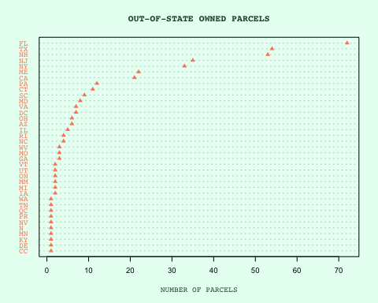
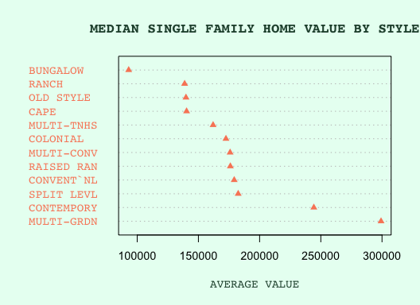

Module04
================
Violet Lingenfelter
February 10, 2019

Overview
--------

This document is an introduction to the 2018 Property Parcel Dataset from the State of Massachusetts GIS department. This dataset contains values for all property parcels asessed in Revere, MA. This dataset is a shapefile with associated data tables, which include information about lot size, use code and zoning information, last list date and list price, owner name and contact information, and information about the residence (if applicable). This data was downloaded at [MassGIS](http://massgis.maps.arcgis.com/apps/View/index.html?appid=4d99822d17b9457bb32d7f953ca08416). Information on which land use codes correspond to land use types came from [Land Use Codes](https://www.mass.gov/files/documents/2016/08/wr/classificationcodebook.pdf), per the MassGIS website.

Mildy Interesting Facts
-----------------------

-   The street with the most parcels addressed to it is "REVERE BEACH BLVD"
-   The most valuable parcel in Revere, 9 Overlook Ridge Dr is comprised of 412 units, over 9.87 acres, and is worth more than $70 million. It also has the most units of any parcel in Revere.
-   The oldest church in Revere, The First Congregational Church, is located at 230 Beach St and was built in 1849.
-   More than 97% of parcels in Revere are owned by people or companies with mailing addresses in Massachusetts.
-   The most valuable style of single family home in Revere is "Multi-garden" with an average assessed value of $299,200
-   The non-Massachusetts states with the most parcel ownership are Florida with 72 parcles, Texas with 54, and New Hampshire with 53 parcels.
-   447 parcels are owned by LLCs. These parcels represent 2.95% of parcels in Revere but 11.12% of total parcels in Revere.

Visuals
-------

First, let's look at out of state parcel ownership. Out of the 400 parcels that are owned by companies or people that reside out of state, where are these owners? This is pretty easily visualized by a Cleveland dot chart (or in this case a triangle chart). From this we can see how number of parcels are broken out into individual states. We can see that the state with the most parcel ownership is Florida. We can also see that there are some states listed here that aren't in the US. QC, for example, references the Canadian province of Quebec.

We can do a similar chart to visualize the value of single family homes, broken down by home style. This will be interestering data to accompany a map; we might want to see if single family homes of certain style are concentrated in certain neighborhoods, or are near certain zoning areas (i.e. industrial areas). We can see that the most valuable home style in Revere is Mulit-Garden, and the least valuable is Bungalow.

