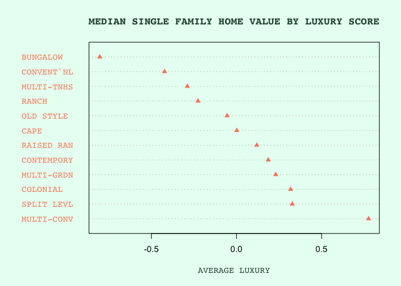
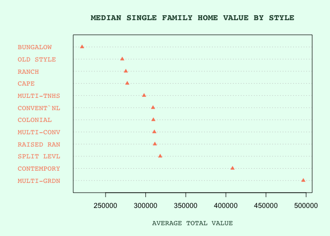
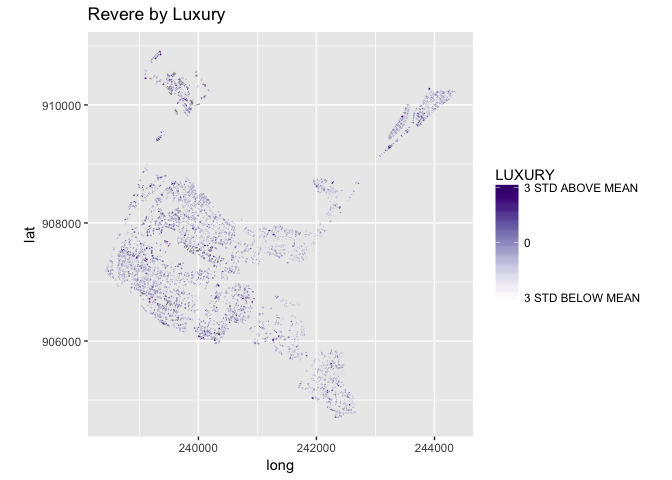
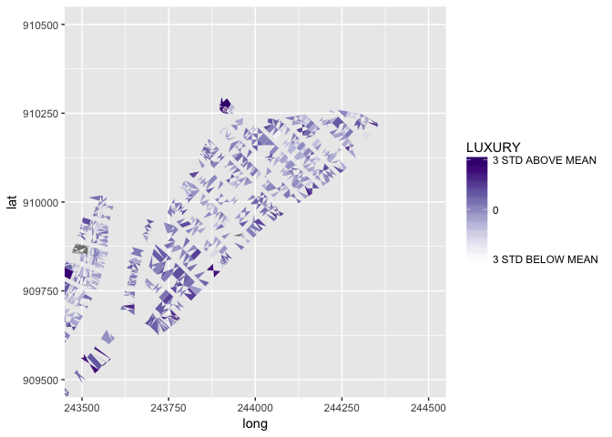
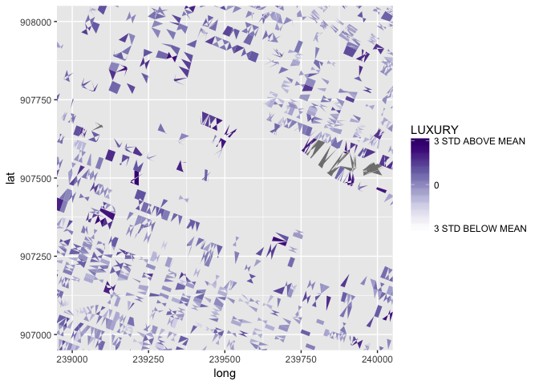
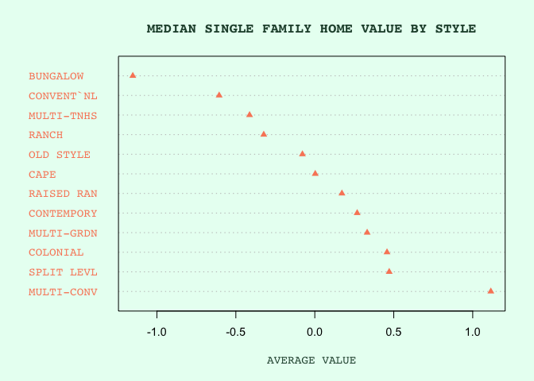
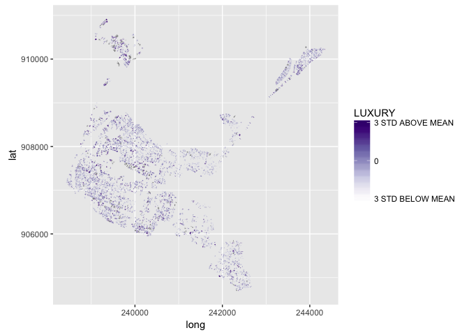
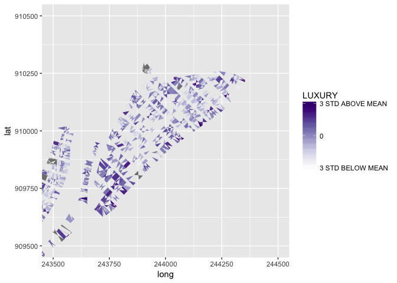
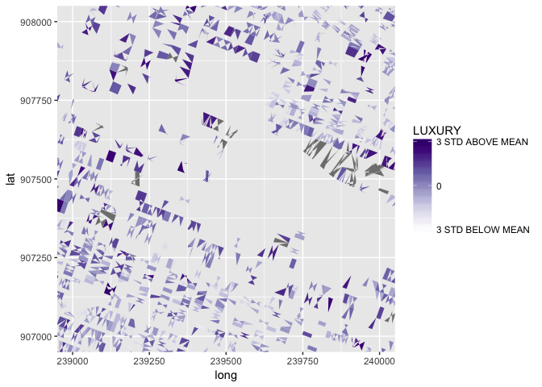

Module08
================
Violet Lingenfelter
March 17, 2019

Luxury by Revere Tax Assessor Data
==================================

### Introduction

"Luxury" by definition is "the state of great comfort and extravagant living". The concept of luxury is often used by relators to market certain living arrangements, i.e. "luxury apartments" or a "luxury lifestyle" being the norm of a neighborhood. This concept of luxury has implications of class, and the concept of luxury apartments date back to the beginning of urban renewal projects.

I thought it would be interesting to make a latent construct to represent "luxury" and apply this to revere tax assessor parcels.

### The Latent Construct: Methodology

To get at the luxury of homes in Revere from tax assessor data, I chose to aggregate several manifest variables. These variables include: - Yard size of a parcel - Number of rooms

In order to make these categories comparable, I chose to find the z-score for each manifest variable. I chose z-scores because that metric is robust to underlying distribution and scales the data so they are comparable to each other. Once I assigned values for each variable and calculated the z-scores, I added these values together to calculate a 'luxury' score.

##### Yard Size

To calculate yard size, I converted lot size from acres to square feet, and then subtracted the building size from the lot size to get the metric. I then calculated the yardsize z-score for each parcel as a way of normalizing the data. This metric is indicitave of luxury because it shows potential for greenspace, which

##### Number of Rooms

To get a metric for number of rooms, I took the existing number of rooms value and normalized it by calculating the z-score for each entry. Again, this was to normalize the data and make it comparable to other variables.

### Findings

We can plot our data for luxury and compare it to total parcel value. We can aggregate these values by building style, which shows us that 'luxurious' building types are not necessarily the more expensive ones.



We can also map our data to see how it is distributed spatially. Below I have mapped the parcels, colored by how luxurious they are. There are two zooms into certain dense pieces of the city.

    ##           name    long_name write  copy isVector
    ## 40 OpenFileGDB ESRI FileGDB FALSE FALSE     TRUE

    ## OGR data source with driver: OpenFileGDB 
    ## Source: "/Users/vlingenfelter5/Desktop/bigData/M248_parcels_gdb/M248_parcels_sde.gdb", layer: "M248TaxPar"
    ## with 12838 features
    ## It has 12 fields

    ## Reading layer `M248Assess' from data source `/Users/vlingenfelter5/Desktop/bigData/M248_parcels_gdb/M248_parcels_sde.gdb' using driver `OpenFileGDB'







We can see that the distrubtion of luxurious homes does not seem especially clustered. It would be interesting to perform spatial analysis on this. I would also like to revamp my analysis to include measurements of distance from centroids of parcels that are coded "single family" to parcels that are coded "industrial", and distance from single family to "cultural" parcels.

### Conclusion

Luxurious homes by themselves do not tell us much. Further analysis should be performed to see how well this metric represents 'luxury' and to further refine the input variables to get a more accurate picture of luxury in the city. I would be interested in seeing if percieved 'luxury', measured without using value, has an effect on gentrification or urban renewal.

Appendix: The Code
==================

``` r
# requre packages
require(ggplot2)
require(stringr)

# load data from CSV
# this is the .dbf file from the geodatabase from module01 & 02 converted to csv
assessor <- read.csv("../assessor.csv")

# find subset of parcels with single family homes
singleFamily <- assessor[assessor$USE_CODE==101,]

# convert acreage to square feet for lot size
singleFamily$LOT_SIZE <- singleFamily$LOT_SIZE * 43560

singleFamily$YARD_SIZE <- singleFamily$LOT_SIZE - singleFamily$BLD_AREA

# find the z score of this variable for all single family parcels
singleFamily$YARD_SIZE_Z <- scale(singleFamily$YARD_SIZE, center = TRUE, scale = TRUE)

# find the z score of the number of rooms in all single family parcels
singleFamily$NUM_ROOMS_Z <- scale(singleFamily$NUM_ROOMS, center = TRUE, scale = TRUE)

singleFamily$AVG_ROOM <- singleFamily$BLD_AREA / singleFamily$NUM_ROOMS
singleFamily$AVG_ROOM_Z <- scale(singleFamily$AVG_ROOM, center = TRUE, scale = TRUE)

# find average building value aggregated by building style for single family homes
buildingByStyle <- aggregate(singleFamily$BLDG_VAL ~ singleFamily$STYLE, FUN = median)
# correct the column names
names(buildingByStyle) <- c('STYLE', 'AVG_BLDG_VAL')
# sort by building value (high value to low value)
buildingByStyle <- buildingByStyle[order(-buildingByStyle$AVG_BLDG_VAL),]

for (i in 1:NROW(singleFamily)) {
  if (grepl("1", singleFamily[i, "STORIES"])) {
    singleFamily[i, "STORIES"] = "1"
  } else if (grepl("2", singleFamily[i, "STORIES"])) {
    singleFamily[i, "STORIES"] = "2"
  } else if (grepl("3", singleFamily[i, "STORIES"])) {
    singleFamily[i, "STORIES"] = "3"
  }
}
```

``` r
singleFamily$LUXURY <- singleFamily$YARD_SIZE_Z + singleFamily$NUM_ROOMS_Z

# find average building value aggregated by building style for single family homes
buildingByStyle <- aggregate(singleFamily$LUXURY ~ singleFamily$STYLE, FUN = median)
# correct the column names
names(buildingByStyle) <- c('STYLE', 'LUXURY')
# sort by building value (high value to low value)
buildingByStyle <- buildingByStyle[order(-buildingByStyle$LUXURY),]

# create a cleaveland dot chart of average value by building style
# make the markers be little triangles
par(bg = "#e8fff2")
dotchart(buildingByStyle$LUXURY, 
         labels=buildingByStyle$STYLE, 
         cex=.9,
         pch=17,
         main="MEDIAN SINGLE FAMILY HOME VALUE BY STYLE",
         xlab="AVERAGE VALUE",
         col = "#F98866",
         family = "mono",
         col.main = "#274F3B",
         col.lab = "#274F3B",
         fg = "#80BD9E")
```



``` r
# import packages for reading .gdb
require(rgdal)
require(sf)
require(rgeos)
require(maptools)
require(ggplot2)
require(plyr)


gdb <- "../M248_parcels_gdb/M248_parcels_sde.gdb"


# Read the feature class
fc <- readOGR(dsn=gdb, layer="M248TaxPar") 
```

    ## OGR data source with driver: OpenFileGDB 
    ## Source: "/Users/vlingenfelter5/Desktop/bigData/M248_parcels_gdb/M248_parcels_sde.gdb", layer: "M248TaxPar"
    ## with 12838 features
    ## It has 12 fields

``` r
fc@data$id = rownames(fc@data)
fc.points = fortify(fc, region="id")
fc.df = join(fc.points, fc@data, by="id")


# read the assessor database file 
# (no geometries associated, error is thrown and it turns the .dbf into a dataframe)
# sort the assessor values by total combined parcel value
assessor <- sf::st_read(dsn = gdb, layer = "M248Assess")
```

    ## Reading layer `M248Assess' from data source `/Users/vlingenfelter5/Desktop/bigData/M248_parcels_gdb/M248_parcels_sde.gdb' using driver `OpenFileGDB'

    ## Warning: no simple feature geometries present: returning a data.frame or
    ## tbl_df

``` r
# Duplicate Geoms = true becaus multiple Assessor data points have same LOC_ID (to be fixed later)
fc.df <- merge(fc.df, singleFamily, by="LOC_ID", duplicateGeoms=TRUE)

# View the feature class (make sure the geometries match the boundaries of Revere MA)
library(RColorBrewer)
my_colors = brewer.pal(9, "Purples") 
my_colors = colorRampPalette(my_colors)(10)
ggplot(fc.df, aes(x = long, y = lat, group = group, fill = LUXURY)) +
    geom_polygon() + 
    coord_equal() +
    scale_fill_gradientn(colors = my_colors,
                           breaks=c(-3,0,3),labels=c("3 STD BELOW MEAN",0,"3 STD ABOVE MEAN"),
                           limits=c(-3,3))
```



``` r
ggplot(fc.df, aes(x = long, y = lat, group = group, fill = LUXURY)) +
    geom_polygon() + 
    coord_cartesian(ylim=c(909500,910500), xlim=c(243500,244500)) + 
    scale_fill_gradientn(colors = my_colors,
                           breaks=c(-3,0,3),labels=c("3 STD BELOW MEAN",0,"3 STD ABOVE MEAN"),
                           limits=c(-3,3))
```



``` r
ggplot(fc.df, aes(x = long, y = lat, group = group, fill = LUXURY)) +
    geom_polygon() + 
    coord_cartesian(ylim=c(907000,908000), xlim=c(239000,240000)) + 
    scale_fill_gradientn(colors = my_colors,
                           breaks=c(-3,0,3),labels=c("3 STD BELOW MEAN",0,"3 STD ABOVE MEAN"),
                           limits=c(-3,3))
```


