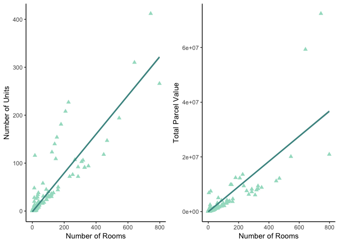
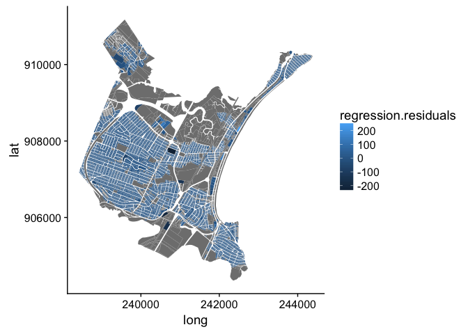

Module09
================
Violet Lingenfelter
March 22, 2019

Correlation
-----------

For looking at correlations, I decided calculate a matrix for all variables I might find interesting in a sort of exploratory approach. I included the following variables in my matrix:

-   building, land, and total values
-   list price
-   number of rooms
-   residential area
-   building area

This matrix can be seen below.

``` r
# import package that we need
require(Hmisc)

# look at relationships between a TON of columns 
# columns looked at: building, land, other, and total value, lot size, list price, year built, number of rooms, and residential area size. 
correlations<-rcorr(as.matrix(assessor[c(4,5,7,11,31,32,35)]))
# class(correlations)


require(formattable)
r <- do.call(rbind.data.frame, correlations[1])

r <- round(r, digits = 3)

# look at r
r <- formattable(r, list(BLDG_VAL = color_tile("white", "#a3dec9"),
                    LAND_VAL = color_tile("white", "#a3dec9"),
                    TOTAL_VAL = color_tile("white", "#a3dec9"),
                    LS_PRICE = color_tile("white", "#a3dec9"),
                    UNITS = color_tile("white", "#a3dec9"),
                    RES_AREA = color_tile("white", "#a3dec9"),
                    NUM_ROOMS = color_tile("white", "#a3dec9")))

r
```

<table class="table table-condensed">
<thead>
<tr>
<th style="text-align:left;">
</th>
<th style="text-align:right;">
BLDG_VAL
</th>
<th style="text-align:right;">
LAND_VAL
</th>
<th style="text-align:right;">
TOTAL_VAL
</th>
<th style="text-align:right;">
LS_PRICE
</th>
<th style="text-align:right;">
UNITS
</th>
<th style="text-align:right;">
RES_AREA
</th>
<th style="text-align:right;">
NUM_ROOMS
</th>
</tr>
</thead>
<tbody>
<tr>
<td style="text-align:left;">
r.BLDG_VAL
</td>
<td style="text-align:right;">
<span style="display: block; padding: 0 4px; border-radius: 4px; background-color: #a3dec9">1.000</span>
</td>
<td style="text-align:right;">
<span style="display: block; padding: 0 4px; border-radius: 4px; background-color: #e8f6f1">0.642</span>
</td>
<td style="text-align:right;">
<span style="display: block; padding: 0 4px; border-radius: 4px; background-color: #aee2cf">0.944</span>
</td>
<td style="text-align:right;">
<span style="display: block; padding: 0 4px; border-radius: 4px; background-color: #eaf7f3">0.497</span>
</td>
<td style="text-align:right;">
<span style="display: block; padding: 0 4px; border-radius: 4px; background-color: #e3f5ee">0.658</span>
</td>
<td style="text-align:right;">
<span style="display: block; padding: 0 4px; border-radius: 4px; background-color: #bde7d8">0.813</span>
</td>
<td style="text-align:right;">
<span style="display: block; padding: 0 4px; border-radius: 4px; background-color: #cdede1">0.788</span>
</td>
</tr>
<tr>
<td style="text-align:left;">
r.LAND_VAL
</td>
<td style="text-align:right;">
<span style="display: block; padding: 0 4px; border-radius: 4px; background-color: #e4f5ef">0.642</span>
</td>
<td style="text-align:right;">
<span style="display: block; padding: 0 4px; border-radius: 4px; background-color: #a3dec9">1.000</span>
</td>
<td style="text-align:right;">
<span style="display: block; padding: 0 4px; border-radius: 4px; background-color: #c2e9db">0.846</span>
</td>
<td style="text-align:right;">
<span style="display: block; padding: 0 4px; border-radius: 4px; background-color: #e6f6f0">0.524</span>
</td>
<td style="text-align:right;">
<span style="display: block; padding: 0 4px; border-radius: 4px; background-color: #def3eb">0.685</span>
</td>
<td style="text-align:right;">
<span style="display: block; padding: 0 4px; border-radius: 4px; background-color: #d9f1e8">0.618</span>
</td>
<td style="text-align:right;">
<span style="display: block; padding: 0 4px; border-radius: 4px; background-color: #bee7d9">0.862</span>
</td>
</tr>
<tr>
<td style="text-align:left;">
r.TOTAL_VAL
</td>
<td style="text-align:right;">
<span style="display: block; padding: 0 4px; border-radius: 4px; background-color: #ade1cf">0.944</span>
</td>
<td style="text-align:right;">
<span style="display: block; padding: 0 4px; border-radius: 4px; background-color: #c0e8da">0.846</span>
</td>
<td style="text-align:right;">
<span style="display: block; padding: 0 4px; border-radius: 4px; background-color: #a3dec9">1.000</span>
</td>
<td style="text-align:right;">
<span style="display: block; padding: 0 4px; border-radius: 4px; background-color: #e3f4ee">0.551</span>
</td>
<td style="text-align:right;">
<span style="display: block; padding: 0 4px; border-radius: 4px; background-color: #d7f0e8">0.720</span>
</td>
<td style="text-align:right;">
<span style="display: block; padding: 0 4px; border-radius: 4px; background-color: #bee7d9">0.805</span>
</td>
<td style="text-align:right;">
<span style="display: block; padding: 0 4px; border-radius: 4px; background-color: #c5eadd">0.827</span>
</td>
</tr>
<tr>
<td style="text-align:left;">
r.LS_PRICE
</td>
<td style="text-align:right;">
<span style="display: block; padding: 0 4px; border-radius: 4px; background-color: #ffffff">0.497</span>
</td>
<td style="text-align:right;">
<span style="display: block; padding: 0 4px; border-radius: 4px; background-color: #ffffff">0.524</span>
</td>
<td style="text-align:right;">
<span style="display: block; padding: 0 4px; border-radius: 4px; background-color: #ffffff">0.551</span>
</td>
<td style="text-align:right;">
<span style="display: block; padding: 0 4px; border-radius: 4px; background-color: #a3dec9">1.000</span>
</td>
<td style="text-align:right;">
<span style="display: block; padding: 0 4px; border-radius: 4px; background-color: #fbfdfd">0.529</span>
</td>
<td style="text-align:right;">
<span style="display: block; padding: 0 4px; border-radius: 4px; background-color: #ffffff">0.355</span>
</td>
<td style="text-align:right;">
<span style="display: block; padding: 0 4px; border-radius: 4px; background-color: #ffffff">0.536</span>
</td>
</tr>
<tr>
<td style="text-align:left;">
r.UNITS
</td>
<td style="text-align:right;">
<span style="display: block; padding: 0 4px; border-radius: 4px; background-color: #e1f4ed">0.658</span>
</td>
<td style="text-align:right;">
<span style="display: block; padding: 0 4px; border-radius: 4px; background-color: #dff3ec">0.685</span>
</td>
<td style="text-align:right;">
<span style="display: block; padding: 0 4px; border-radius: 4px; background-color: #dcf2ea">0.720</span>
</td>
<td style="text-align:right;">
<span style="display: block; padding: 0 4px; border-radius: 4px; background-color: #e6f6f0">0.529</span>
</td>
<td style="text-align:right;">
<span style="display: block; padding: 0 4px; border-radius: 4px; background-color: #a3dec9">1.000</span>
</td>
<td style="text-align:right;">
<span style="display: block; padding: 0 4px; border-radius: 4px; background-color: #e8f6f1">0.513</span>
</td>
<td style="text-align:right;">
<span style="display: block; padding: 0 4px; border-radius: 4px; background-color: #b5e4d4">0.905</span>
</td>
</tr>
<tr>
<td style="text-align:left;">
r.RES_AREA
</td>
<td style="text-align:right;">
<span style="display: block; padding: 0 4px; border-radius: 4px; background-color: #c5eadd">0.813</span>
</td>
<td style="text-align:right;">
<span style="display: block; padding: 0 4px; border-radius: 4px; background-color: #ecf8f4">0.618</span>
</td>
<td style="text-align:right;">
<span style="display: block; padding: 0 4px; border-radius: 4px; background-color: #caece0">0.805</span>
</td>
<td style="text-align:right;">
<span style="display: block; padding: 0 4px; border-radius: 4px; background-color: #ffffff">0.355</span>
</td>
<td style="text-align:right;">
<span style="display: block; padding: 0 4px; border-radius: 4px; background-color: #ffffff">0.513</span>
</td>
<td style="text-align:right;">
<span style="display: block; padding: 0 4px; border-radius: 4px; background-color: #a3dec9">1.000</span>
</td>
<td style="text-align:right;">
<span style="display: block; padding: 0 4px; border-radius: 4px; background-color: #b2e3d1">0.924</span>
</td>
</tr>
<tr>
<td style="text-align:left;">
r.NUM_ROOMS
</td>
<td style="text-align:right;">
<span style="display: block; padding: 0 4px; border-radius: 4px; background-color: #c9ebdf">0.788</span>
</td>
<td style="text-align:right;">
<span style="display: block; padding: 0 4px; border-radius: 4px; background-color: #bde7d8">0.862</span>
</td>
<td style="text-align:right;">
<span style="display: block; padding: 0 4px; border-radius: 4px; background-color: #c6eadd">0.827</span>
</td>
<td style="text-align:right;">
<span style="display: block; padding: 0 4px; border-radius: 4px; background-color: #e5f5ef">0.536</span>
</td>
<td style="text-align:right;">
<span style="display: block; padding: 0 4px; border-radius: 4px; background-color: #b4e4d3">0.905</span>
</td>
<td style="text-align:right;">
<span style="display: block; padding: 0 4px; border-radius: 4px; background-color: #ade1cf">0.924</span>
</td>
<td style="text-align:right;">
<span style="display: block; padding: 0 4px; border-radius: 4px; background-color: #a3dec9">1.000</span>
</td>
</tr>
</tbody>
</table>
From looking at this matrix, we can see how correlated some of our variables are with each other. To make this more readily apparent, I chose to highlight each piece of the table based on the value of r. We can see that the least correlated variable to any other variable is LS\_PRICE. This means that list prices have little correlation with any of the other variables I chose to include in the matrix.

An interesting column to look at is the NUM\_ROOMS column. We can see that the number of rooms a building on a parcel had has a strong positive correlation with every variable besides LS PRICE. This is interesting because it is not something I expected.

``` r
require(ggplot2)
require(cowplot)
 
# make scatter plot with regression 
plot1 = ggplot(assessor, aes(x=NUM_ROOMS, y=UNITS)) +
  theme_classic() +
  geom_point(size=2, color="#a3dec9", shape=17) + 
  geom_smooth(method=lm, color="#499491") +
  xlab("Number of Rooms") + 
  ylab("Number of Units")

plot2 = ggplot(assessor, aes(x=NUM_ROOMS, y=TOTAL_VAL)) +
  theme_classic() +
  geom_point(size=2, color="#a3dec9", shape=17) + 
  geom_smooth(method=lm, color="#499491") +
  xlab("Number of Rooms") + 
  ylab("Total Parcel Value")

plot_grid(plot1, plot2)
```



``` r
regression<-lm(NUM_ROOMS~TOTAL_VAL+UNITS+RES_AREA, data=assessor)

summary(regression)
```

    ## 
    ## Call:
    ## lm(formula = NUM_ROOMS ~ TOTAL_VAL + UNITS + RES_AREA, data = assessor)
    ## 
    ## Residuals:
    ##      Min       1Q   Median       3Q      Max 
    ## -235.577   -1.249   -0.074    1.087  250.208 
    ## 
    ## Coefficients:
    ##               Estimate Std. Error t value Pr(>|t|)    
    ## (Intercept)  3.852e+00  5.546e-02   69.46   <2e-16 ***
    ## TOTAL_VAL   -9.662e-06  1.740e-07  -55.52   <2e-16 ***
    ## UNITS        6.738e-01  1.928e-02   34.95   <2e-16 ***
    ## RES_AREA     2.719e-03  3.016e-05   90.17   <2e-16 ***
    ## ---
    ## Signif. codes:  0 '***' 0.001 '**' 0.01 '*' 0.05 '.' 0.1 ' ' 1
    ## 
    ## Residual standard error: 5.713 on 12105 degrees of freedom
    ##   (3000 observations deleted due to missingness)
    ## Multiple R-squared:  0.8928, Adjusted R-squared:  0.8928 
    ## F-statistic: 3.36e+04 on 3 and 12105 DF,  p-value: < 2.2e-16

``` r
assessor<-merge(assessor,data.frame(regression$residuals),by='row.names',all.x=TRUE)
```

Regression
----------

We can see from this regression, where we looked at total value, number of units, and residential area as explanatory variables for number of rooms, that our model is okay but missing some variables. We can see that 89% of the variation in number of rooms can be explained by total value, number of units, and residential area. We can map these residuals so as to see if any geographic areas are not explained by this non geographically weighted regression.

``` r
require(rgdal)
require(sp)

gdb <- "../M248_parcels_gdb/M248_parcels_sde.gdb"

assessor_geo<-readOGR(dsn=gdb, layer="M248TaxPar")
```

    ## OGR data source with driver: OpenFileGDB 
    ## Source: "/Users/vlingenfelter5/Desktop/bigData/M248_parcels_gdb/M248_parcels_sde.gdb", layer: "M248TaxPar"
    ## with 12838 features
    ## It has 12 fields

``` r
require(ggplot2)
require(ggmap)
require(maptools)
require(rgeos)

assessor_geo<-fortify(assessor_geo, region = "LOC_ID")
assessor_geo<-merge(assessor_geo,assessor,by.x='id',by.y='LOC_ID',duplicateGeoms=TRUE)

assessor_geo<-assessor_geo[order(assessor_geo$order),]

ggplot() + 
  geom_polygon(aes(x=long, y=lat, group=group, fill=regression.residuals), data=assessor_geo)
```



We can see from this map that there is a little cluster of parcels by the beach where ther is a low number of rooms but potentially high expected value given our regression model. This suggests to me that there is a geographic element that is missing in our model.

Conclusion
----------

From this exploratory analysis, I conclude that I want to look further into the effect the number of rooms a building has on its value. I think I would like to look at how this relationship changes based on the building code that a parcel is coded under.
